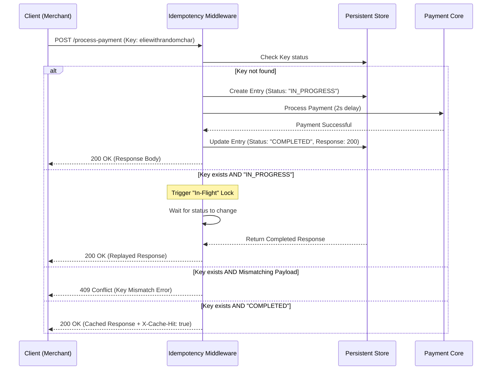

## FinSafe Idempotency Gateway

A lightweight, production-ready Idempotency Gateway built with pure Java (JDK 18+). This system ensures "exactly-once" processing for payment requests, preventing duplicate charges and protecting against payload tampering.

#### Key Features

    Idempotency Guarantee: Ensures that duplicate requests with the same key return the original cached response.

    Fraud Protection: Validates that subsequent requests with a known key match the original payload; rejects mismatches with 409 Conflict.

    Thread Safety: Utilizes ConcurrentHashMap and atomic operations to handle high-concurrency environments.

    Self-Healing: Built-in TTL (Time-To-Live) cleanup mechanism using a background scheduler to prevent memory leaks.

    Zero-Framework: Built using native com.sun.net.httpserver to demonstrate core understanding of Java networking.

### Architecture Diagram

The following sequence diagram illustrates the request lifecycle, including the "In-Flight" locking mechanism to prevent race conditions.

### API Documentation

POST /process-payment

Processes a payment request.

Headers:

    Idempotency-Key (Required): A unique string identifying the transaction.

Request Body (JSON):
JSON

{
"amount": 100
}

Responses:

    200 OK: Payment successful or cached response retrieved.

    400 Bad Request: Missing Idempotency-Key.

    409 Conflict: Key reuse with inconsistent payload detected (Fraud).

    504 Gateway Timeout: Processing took longer than the defined threshold.

### Testing Guide

1. The Happy Path

   Send a POST request with header Idempotency-Key: test-123.

   Observe the 200 OK response and a ~2-second delay.

2. Idempotency Test

   Send the exact same request again.

   Observe the 200 OK response delivered instantly.

   Check the headers for X-Cache-Hit: true.

3. Fraud Detection Test

   Send a request with Idempotency-Key: test-123 and {"amount": 100}.

   Send a request with Idempotency-Key: test-123 but change the body to {"amount": 500}.

   Observe the 409 Conflict error.

##### Thank you!!
