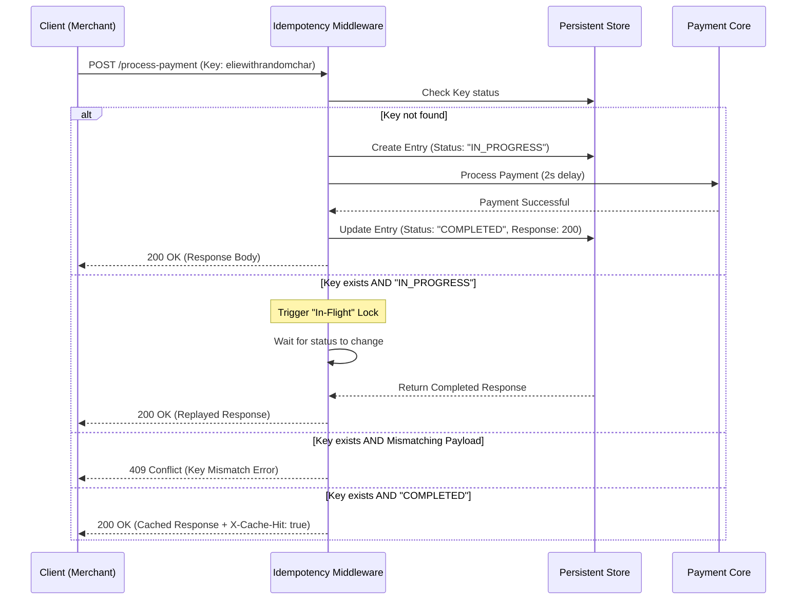

### Architecture Diagram

The following sequence diagram illustrates the request lifecycle, including the "In-Flight" locking mechanism to prevent race conditions.

```mermaid
sequenceDiagram
    participant C as Client (Merchant)
    participant M as Idempotency Middleware
    participant DB as Persistent Store
    participant P as Payment Core

    C->>M: POST /process-payment (Key: eliewithrandomchar)
    M->>DB: Check Key status

    alt Key not found
        M->>DB: Create Entry (Status: "IN_PROGRESS")
        M->>P: Process Payment (2s delay)
        P-->>M: Payment Successful
        M->>DB: Update Entry (Status: "COMPLETED", Response: 200)
        M-->>C: 200 OK (Response Body)

    else Key exists AND "IN_PROGRESS"
        Note over M: Trigger "In-Flight" Lock
        M->>M: Wait for status to change
        DB-->>M: Return Completed Response
        M-->>C: 200 OK (Replayed Response)

    else Key exists AND Mismatching Payload
        M-->>C: 409 Conflict (Key Mismatch Error)

    else Key exists AND "COMPLETED"
        M-->>C: 200 OK (Cached Response + X-Cache-Hit: true)
    end
```
